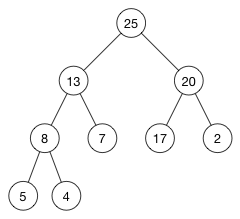

# 힙 정렬 (Heap Sort)

**들어가기에 앞서**

- 이 글은 *Matthijs Hollemans* 가 최초 작성하였고, [*Kangsoo Lee*](https://github.com/oaksong) 가 한국어로 번역하였습니다.
- 소스 코드와 예제 프로젝트는 Swift Algorithm Club의 [원 글 저장소](https://github.com/raywenderlich/swift-algorithm-club/tree/master/Heap%20Sort)에서 확인할 수 있습니다.
- Swift Algorithm Club의 [한국어 번역판 저장소](https://github.com/oaksong/swift-algorithm-club-ko)에서 더 많은 자료를 만나보세요.

---

힙을 사용하여 배열을 오름차순으로 정렬해보자.

힙은 부분적으로 정렬된 배열 기반의 이진 트리이다. 힙의 구조적인 특성을 활용하는 힙 정렬 알고리즘을 통해 정렬을 빠르게 할 수 있다.

힙 정렬을 사용하여 오름차순으로 정렬하려면, 우선 정렬되지 않은 배열을 최대 힙으로 변환한다. 그러면 첫 번째 원소는 가장 큰 값이 된다.

다음과 같은 배열이 주어졌다고 하자.

```
[ 5, 13, 2, 25, 7, 17, 20, 8, 4 ]
```

이것을 최대 힙으로 바꾸면 다음과 같은 모양이 된다.



이 힙의 배열은 다음과 같다.

```
[ 25, 13, 20, 8, 7, 17, 2, 5, 4 ]
```

그런데 이대로는 정렬이 되었다고 보기 어렵다! 지금부터 정렬이 시작되는 것이다. 인덱스 *0* 에 있는 첫 번째 원소와 *n-1*에 있는 마지막 원소의 자리를 교체한다.

```
[ 4, 13, 20, 8, 7, 17, 2, 5, 25 ]
  *                          *
```

이제 새로운 루트 노드인 `4`가 되는데 자식들보다 값이 작다. 따라서 *n-2* 번째 노드까지 *shift down* 또는 "heapify"하여 최대 힙으로 바로잡는다. 힙을 다 바로잡고 나면 두 번째로 큰 원소가 새로운 루트 노드가 된다.

```
[20, 13, 17, 8, 7, 4, 2, 5 | 25]
```

중요: 힙을 바로 잡는 과정 중에 마지막 원소인 *n-1* 번째 원소는 무시한다. 이 원소는 배열의 최대값으로서 최종 위치에 있는 셈이다. `|`는 배열 중 정렬된 부분이 시작되는 기점을 의미한다. 앞으로 이쪽 부분은 건드리지 않고 넘기기로 한다.

다시, 정렬되지 않은 부분 중 첫 번째 원소와 마지막 원소(이번에는 *n-2* 째 위치)를 교체한다.

```
[5, 13, 17, 8, 7, 4, 2, 20 | 25]
 *                      *
```

그리고 다시 최대 힙 상태로 유지시키기 위해 힙을 바로잡는다.

```
[17, 13, 5, 8, 7, 4, 2 | 20, 25]
```

보시다시피 큰 원소들은 뒷쪽으로 물러나게 된다. 루트 노드에 닿을 때까지 이 과정을 반복하여 배열 전체를 정렬한다.

> **노트:** 이 과정은 나머지 배열 중에서 최소값을 반복적으로 찾아내는 선택 정렬의 방식과 비슷하다. 힙 정렬은 최소값 또는 최대값을 추출하는 것에 강하다는 것이 다르다.

힙 정렬의 성능은 최선의 경우 그리고 평균적으로 **O(n log n)** 이다. 배열을 직접적으로 수정하기 때문에 제자리에서 정렬이 가능하다. 그렇지만 힙 정렬은 안정 정렬(stable sort)이 아니다. 같은 값을 가진 원소들의 순서가 정렬 후에는 뒤바뀔 수 있다.

다음은 힙 정렬을 Swift로 구현한 것이다.

```swift
extension Heap {
  public mutating func sort() -> [T] {
    for i in stride(from: (elements.count - 1), through: 1, by: -1) {
      swap(&elements[0], &elements[i])
      shiftDown(0, heapSize: i)
    }
    return elements
  }
}
```

이전에 구현한 힙을 확장(extension)하여 `sort()`라는 이름의 함수로 구현한 것이다. 함수의 사용은 다음과 같다.

```swift
var h1 = Heap(array: [5, 13, 2, 25, 7, 17, 20, 8, 4], sort: >)
let a1 = h1.sort()
```

오름차순으로 정렬하기 위해 힙을 사용하였듯이, 정렬하고자 하는 순서의 반대로 `Heap`을 만들어야 한다. 즉 `<`로 정렬하려면 `Heap`은 `>`로 생성하여야 하는 것이다. 다시 말해 오름차순 정렬이란 최대 힙을 최소 힙으로 바꾸는 것이라고 할 수 있다.

다음의 helper 함수를 통해 더 간편하게 이용할 수도 있다.

```swift
public func heapsort<T>(_ a: [T], _ sort: @escaping (T, T) -> Bool) -> [T] {
  let reverseOrder = { i1, i2 in sort(i2, i1) }
  var h = Heap(array: a, sort: reverseOrder)
  return h.sort()
}
```

## References

- [Heap Sort - Swift Algorithm Club](https://github.com/raywenderlich/swift-algorithm-club/tree/master/Heap%20Sort)