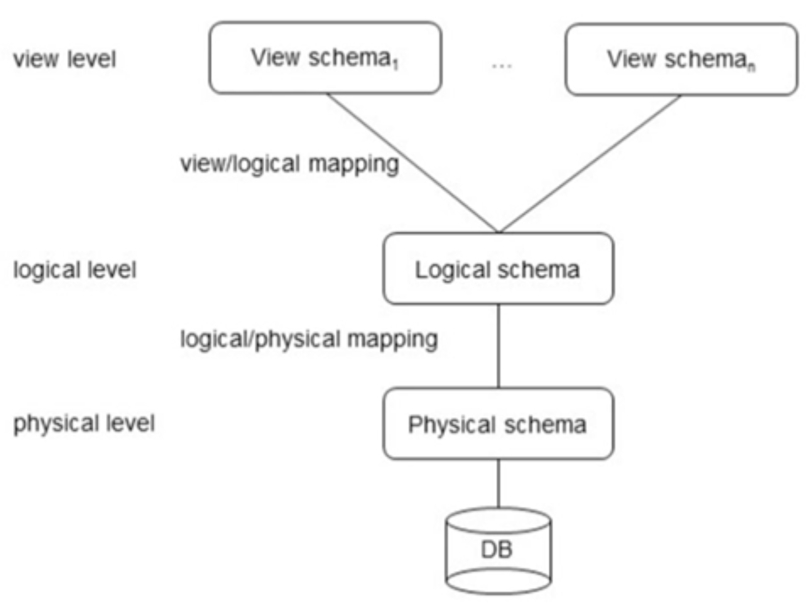

# 데이터베이스 part1

`데이터베이스(Database)`는 대용량의 데이터를 관리하는 것으로 구조화/비구조화된 데이터들을 효과적으로 다룰 수 있게 한다.

# 1장 서론

## 관련 용어

- DB(Database): 데이터들의 모임
- DBMS(Database Management Software): 데이터베이스를 관리하는 소프트웨어로 `data independence`, `data sharing`, `recovery`, `security` 등 효과적인 기능을 제공한다.
- DBS(Database System): DB + DBMS

## DBMS의 이점

- 데이터 추상화: 복잡한 데이터를 단순하게 표현.
- 데이터에 쉽게 접근
  - 데이터베이스 언어의 지원
  - 유저 인터페이스 제공
- 데이터 반복이나 일관성을 제어
- **무결성 제약조건(Integrity constraint enforcement)**
  - `데이터 무결성`은 데이터의 **정확도**, **유효성**을 나타냄.
  - **일관된 데이터베이스의 상태**를 정의하는 규칙들을 묵시적 또는 명시적으로 정의하는 것.
  - 사용자의 데이터베이스 갱신이 데이터베이스의 일관성을 깨지 못하게 함.
- 업데이트의 원자성(Atomicity)
  - 데이터베이스의 상태를 지키기 위해.
- 많은 사용자들의 동시적(Concurrent) 접근을 제어
- 데이터 보안
- 데이터 백업과 복원

## 파일 시스템(File System)

운영체제에서 제공하는 것으로 **이론적으로는** 사용자가 데이터를 관리 가능. 그러나 사용자가 많은 기능들을 직접 구현해야 하기 때문에 DBMS를 사용하는 것이 낫다.

### 파일 시스템 vs 데이터베이스

#### 간단한 비교

|  

 |  
파일 시스템
 |  
데이터베이스
 |
|:--------|:--------:|--------:|
|**속도** | 
상대적으로 빠르다
 |
 상대적으로 느리다 
 |
|**비용** | 
저렴하다
 |
비싸다
 |
|**개발 생산성** | 
기대하기 어렵다
 |
보장된다(표준 SQL, 개발기간 절감, 운영비용 절감)
|

또한 **자료의 중복 방지**, **데이터 무결성 보장**에서 데이터베이스가 이점이 있다.

#### 파일 시스템의 단점
- **데이터 종속성**: 응용 프로그램과 데이터 간의 상호 의존관계로 인해 데이터 파일을 저장하는 구조가 변경되면 응용 프로그램도 변경해야 한다.
- **데이터 중복성**: 한 시스템 내의 데이터가 중복 저장, 관리되어 관련된 데이터가 중복 저장된다. 이는 응용 프로그램의 독립적인 파일 관리로 인해 각각의 응용 프로그램이 파일을 가지게 됨으로 인해 생기는 문제점이다.
  - 일관성: 여러 개의 데이터가 하나의 사실만을 나타낸다면 논리적으로 동일하지만, 중복이 있을 경우 동일성을 유지하기가 어렵다.
  - 보안성: 데이터의 중복은 모두 똑같은 수준의 보안을 어렵게 함. 인가되지 않은 변경에 대한 데이터 무결성을 유지하기가 어려움.
  - 경제성: 같은 내용을 저장하는 것은 저장 공간의 추가 이용으로 인해 비용을 증가시킴.

## 스키마와 인스턴스

- `스키마(Schema)`: 타입
- `인스턴스(Instance)`: 타입의 실체적인 값

## 추상화(Abstraction)

복잡한 문제를 겉가지들을 쳐내고 **단순화**하여 **본질적**인 것을 다루게끔 하는 기법. **추상화 레벨**을 다르게 하여 문제를 다양한 시선에서 볼 수 있다.

데이터베이스에서는 3가지 추상화 수준이 있다.

- Physical level: 레코드가 실질적으로 어떻게 저장되는지. (ex. 레코드의 길이.)
- Logical level: 데이터 사이의 관계. `스키마`를 정의한다.
- View level: 사용자가 보는 데이터를 제한하는 것. **보안**의 목적을 띈다.

**Three-schema Architecture**

세 레벨의 스키마로 나뉘어져 있기 때문에 `데이터 독립성(Data independence)`을 제공한다. 이것은 **다른 레벨의 스키마에 변경 사항을 적용시키지 않는 특성**이다.

## 데이터 모델(Data Model)

데이터 추상화를 제공하는 도구, 상세.

- Relational Data Model: 관계형. 테이블로 표현.
- Object RDM: 객체 지향 개념을 도입해 표현력이 크다.
- XML: 웹 데이터를 표현하는 형식.

## Database Users

- Naive users: 일반 사용자(ex. 은행 창구 직원).
- Application programmers
- Database analysts
- Database administrator (DBA)

# 2장 RDB Model(관계형 모델)

`관계(relation)`의 `set`과 `제약(constraint)`의 `set`으로로 표현되는 모델. 우리가 흔히 보는 `테이블`의 모습을 띄고 있다.

- `relation` = table
- `tuple` = record, row
- `attribute` = column

## Attributes

- 속성의 값을 모두 모은 것은 `domain`
- 속성값은 **원자적**(**indivisible**)이어야 함.
- 기본값(default)으로 `null`값을 가진다.

## Order is immaterial

- `관계` 간 순서는 없다.
- `tuple`의 순서는 중요하지 않다.

## Keys

- 슈퍼 키(super key): `유일성`을 만족하는 속성 또는 속성들의 집합.
- 후보 키(candidate key): `유일성`과 `최소성`을 만족하는 속성 또는 속성들의 집합.
- 기본 키(primary key): 후보키 중 `기본적`으로 사용하기 위한 키.
- 외래 키(foreign key): 다른 릴레이션의 **기본 키를 참조**하는 속성 또는 속성들의 집합.

## 참조 무결성 제약

`관계형 모델`에서만 나오는 제약으로 데이터의 관계가 `값(value)`에 의해서 이루어지기 때문에 나오는 제약. 참조 관계일 경우 함부로 지울 수 없다.

---

## Reference

- [데이터 베이스 강의 - 숭실대학교 이상호 교수님](http://www.kocw.net/home/search/kemView.do?kemId=1132753)
- [[데이터베이스 기초] 데이터베이스의 개념, 파일시스템과 비교](http://neokido.tistory.com/entry/데이터베이스-기초-데이터베이스의-개념-파일시스템과-비교)
