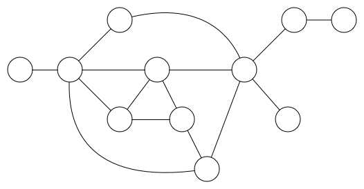
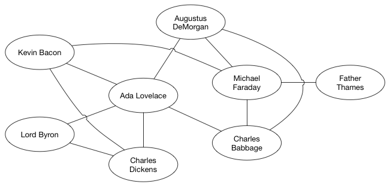
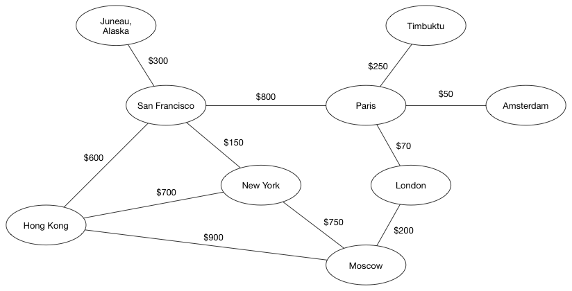
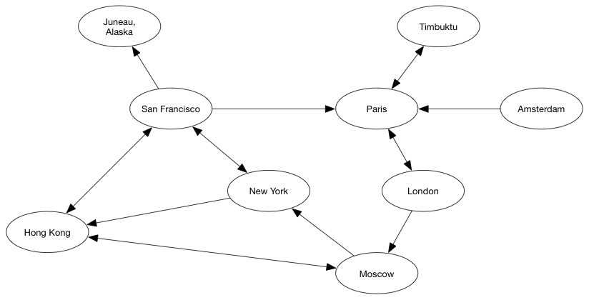
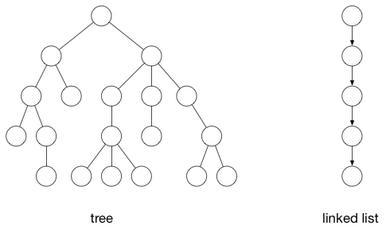
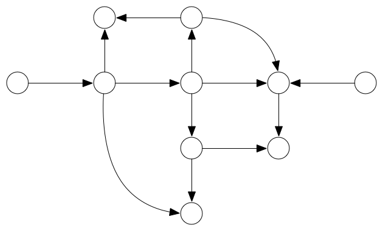
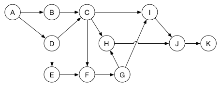
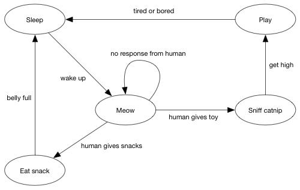

# 그래프 (Graph)

**들어가기에 앞서**

- 이 글은 *Donald Pinckney* 와 *Matthijs Hollemans* 가 최초 작성하였고, [*Kangsoo Lee*](https://github.com/oaksong)가 한국어로 번역하였습니다.
- 소스 코드와 예제 프로젝트는 Swift Algorithm Club의 [원 글 저장소](https://github.com/raywenderlich/swift-algorithm-club/tree/master/Graph)에서 확인할 수 있습니다.
- Swift Algorithm Club의 [한국어 번역판 저장소](https://github.com/oaksong/swift-algorithm-club-ko)에서 더 많은 번역글을 만나보세요.

---

> 이 주제에 대한 튜토리얼은 [이곳](https://www.raywenderlich.com/152046/swift-algorithm-club-graphs-adjacency-list)에서 볼 수 있다.

그래프는 다음과 같은 모습을 하고 있다.



컴퓨터 과학에서 그래프는 *정점(vertex)* 들과 *간선(edge)* 들의 집합으로 정의된다. 정점들은 원으로, 간선들은 정점들 사이의 선으로 표현한다. 간선들은 하나의 정점과 다른 정점들을 연결한다.

> **노트:** 정점은 "노드(node)"로, 간선은 "링크(link)"로 표현되기도 한다.

그래프로 사회 연결망을 표현할 수 있다. 사람 한 명을 하나의 정점으로 표현하고, 서로 아는 사람들끼리 간선으로 연결한다. 예를 들면 다음과 같다.



그래프는 다양한 형태와 크기로 표현될 수 있다. 그리고 간선은 양수 또는 음수의 *가중치(weight)* 를 가질 수 있다. 비행기 항공편을 나타내는 그래프를 예로 들어보자. 도시들은 정점으로 항공편들은 간선으로 표현할 수 있다. 그리고 간선의 가중치로서 항공편의 소요 시간이나 티켓 가격 정보를 표현할 수 있다.



San Francisco에서 Moscow로 가려면 New York을 거치는 것이 가장 저렴하다.

간선은 또한 *방향을 가질(directed)* 수 있다. 위의 예에서는 방향을 가진 간선은 없다. 만약에 Ada가 Charles를 안다면 Charles도 Ada를 알 것이다. 이와 반대로 단방향의 간선은 한 방향의 관계만을 의미한다. 정점 X에서 정점 Y로의 단방향 간선은 X에서 Y로는 연결하지만, Y에서 X로는 그렇지 않다.

항공편 예로 돌아가서, San Francisco에서 Alaska의 Juneau로의 단방향 간선을 보면 San Francisco에서 Juneau로의 항공편은 있지만, Juneau에서 San Francisco로의 항공편은 없다 (아마 걸어 돌아가야 할 것이다).



다음의 것들도 그래프의 일종이다.



왼쪽은 트리이고, 오른쪽은 연결 리스트이다. 이것들은 간단한 형태의 그래프로 볼 수 있다. 모두 정점(노드)들과 간선(링크)들을 가지고 있다.

그래프는 사이클(cycle)을 가질 수 있는데, 사이클을 통해 정점에서 출발하여 경로를 따라 원래 정점으로 돌아올 수 있다. 트리는 사이클이 없는 그래프이다.

또다른 일반적인 형태의 그래프는 단방향 비순환 그래프(directed acyclic graph, DAG)이다:



트리와 마찬가지로 이 그래프에는 사이클이 없지만 (어디에서 출발하든 시작점으로 다시 돌아올 수 없다), 방향이 있는 간선들을 포함하고 있으며 계층적인 형태가 필수적이지 않다.

## 왜 그래프를 사용할까?

왜 그래프를 사용하는 것인지, 아마 어깨를 으쓱해하며 생각할 것이다. 그래프는 유용한 자료 구조로 알려져 있다.

만약 정점들과 간선들로 표현할 수 있는 데이터를 포함하는 프로그래밍 문제라면, 너비 우선 탐색(breadth-first search)이나 깊이 우선 탐색(depth-first search)과 같은 유명한 그래프 알고리즘을 사용하여 문제를 정의하고 해결법을 찾을 수 있을 것이다.

예를 들어, 작업들의 목록이 있는데 어떤 작업들이 다른 작업들이 끝날 때까지 기다려야 하는 문제가 있다고 하자. 단방향 비순환 그래프를 사용하여 이 문제를 모델링할 수 있다:



정점은 작업을 의미한다. 정점들 사이의 간선은 반드시 시작점의 작업이 끝나야 도착점의 작업이 시작될 수 있다는 것을 의미한다. 예를 들어 작업 C는 B와 D가 끝날 때까지 시작될 수 없고, B나 D는 A가 끝날 때까지 시작할 수 없다.

그래프로 표현된 이 문제를 가지고 이제, 깊이 우선 탐색을 사용하여 위상 정렬(topological sort)을 수행할 수 있다. 최소한의 시간으로 모든 작업들이 완료되도록 작업들은 가장 바람직한 순서로 정렬될 것이다. (가능한 한 가지 순서는 A, B, D, E, C, F, G, H, I, J, K이다.)

잘 풀리지 않는 프로그래밍 문제를 만날 때에는 "이 문제를 그래프를 사용하여 표현할 수 있을까?"라고 스스로에게 질문을 던져보자. 그래프는 데이터 사이의 관계 표현에 대한 것이다. 이것은 "관계"를 어떻게 정의하느냐에 달려 있다.

당신이 만약 음악가라면 이 그래프를 이해할 것이다:


정점들은 C 메이저 스케일의 코드들이다. 간선들은 이 코드들 사이의 관계를 의미하는데, 한 코드가 어떤 코드 이후에 따라 나올 가능성을 뜻한다. 이것은 단방향 그래프로서 화살표의 방향을 보고 어느 정점에서 어느 정점으로 연결되는지 보여준다. 또한 가중치가 있는 그래프로서 간선의 두께가 두껍다면 강한 관계가 있음을 보여준다. G7 코드는 이후에 C 코드가 나올 가능성이 크고, Am 코드는 나올 가능성이 적다.

당신은 아마 알지도 못한 채 이미 그래프를 사용하고 있을 수 있다. Apple의 Core Data 문서에 따르면 데이터 모델은 그래프이다:


프로그래머들이 흔히 사용하는 또다른 그래프로는 상태 기계(state machine)가 있다. 간선들은 상태들 사이의 전이 조건을 묘사한다. 다음은 고양이의 상태 기계 예시이다:



그래프 훌륭한 자료구조이다. Facebook은 그들의 사회적 그래프를 통해 큰 돈을 벌었다. 만약 자료구조를 학습하고자 한다면 그래프와 방대한 그래프 알고리즘의 모음을 선택하는 것을 추천한다.

## 정점들과 간선들

이론적으로 그래프는 무수한 정점들과 간선들의 집합일 뿐이다. 그런데 이것을 어떻게 코드로 표현할 수 있을까?

두 가지 주요한 전략이 있다: 인접 리스트(adjacency list)와 인접 행렬(adjacency matrix).

**인접 리스트.** 인접 리스트에서 각 정점은 이 정점으로부터 비롯된 간선들의 리스트를 가지고 있다. 예를 들어 만약 정점 A가 정점 B, C, D와 간선들로 연결되어 있다면 정점 A는 3개의 간선을 포함하는 리스트를 가질 것이다.


인접 리스트는 바깥으로 뻗는 간선들을 보여준다. 정점 A에서 B로 향하는 간선은 있지만 정점 B에서 A로 향하는 간선은 없다. 따라서 B의 인접리스트에서 A는 보이지 않는 것이다. 간선으로의 임의 접근(random access)이 불가능하기 때문에 두 정점 사이의 간선이나 가중치를 찾는 일은 상당한 비용이 든다. 찾을 때까지 인접 리스트를 순회해야 한다.

**인접 행렬.** 인접 행렬의 행과 열은 정점들을 의미하는데, 교차하는 지점에 저장된 값은 두 정점이 연결되어 있고 얼마만큼의 가중치로 연결되어 있는지를 나타낸다. 예를 들어 정점 A에서 B로의 단방향 간선은 5.6의 가중치를 가지는데, 행렬에서 A와 B가 교차하는 지점의 값이 5.6이다.


새로운 정점 하나를 그래프에 추가하는 비용은 크다. 왜냐하면 인접 행렬에 이 정점에 해당하는 행과 열을 추가하기 위한 공간이 필요한데, 이 때 완전히 새로운 복사본을 만들어야 하기 때문이다.

그래서 둘 중에 어떤 것을 사용하는 것이 좋을까? 대부분의 경우에는 인접 리스트를 사용하는 것이 좋다. 둘을 자세히 비교해보자. 다음의 표에서 V는 정점의 수를 E는 간선의 수를 뜻한다.

| 작업       | 인접 리스트 | 인접 행렬 |
|-----------------|----------------|------------------|
| 저장 공간   | O(V + E)       | O(V^2)           |
| 정점 추가      | O(1)           | O(V^2)           |
| 간선 추가        | O(1)           | O(1)             |
| 인접성 확인 | O(V)           | O(1)             |

"인접성 확인"이란 주어진 정점이 다른 정점에 바로 붙어 있는지 확인하는 것을 의미한다. 인접 리스트의 인접성을 확인하는 데에는 O(V) 시간이 소요되는데, 최악의 경우에는 하나의 정점에 나머지 모든 정점들이 연결되어 있을 수 있기 때문이다. 이런 상황에서는 인접 행렬을 사용하는 것이 더 낫다.

정점끼리의 연결이 *희박한(sparse)* 그래프에서는 인접 리스트가 최선의 선택이다. 반대로, 정점끼리의 연결이 빽빽한 그래프의 경우에는 인접 행렬을 사용하는 것이 바람직하다.

인접 리스트와 인접 행렬가 코드로 구현된 모습을 살펴보자.

## 코드: 정점과 간선

각 정점에 대한 인접 리스트는 `Edge` 객체들로 구성되어 있다.

```swift
public struct Edge<T>: Equatable where T: Equatable, T: Hashable {

  public let from: Vertex<T>
  public let to: Vertex<T>

  public let weight: Double?

}
```

이 구조체는 "from" 정점과 "to" 정점 그리고 가중치를 표현하고 있다. `Edge` 객체는 항상 단방향(그림에서는 화살표)으로만 표현된다는 점에 유의하자. 만약 양방향으로 연결하고 싶다면 반대 방향으로의 `Edge` 객체를 추가하면 된다. 모든 `Edge`는 선택적으로 가중치를 포함할 수 있기 때문에 가중 그래프와 비가중 그래프를 모두 표현할 수 있다.

정점은 다음과 같다.

```swift
public struct Vertex<T>: Equatable where T: Equatable, T: Hashable {

  public var data: T
  public let index: Int

}
```

이 구조체는 제네릭 타입인 `T`를 사용하여 임의 데이터를 저장할 수 있는데, `Hashable과` `Equatable` 프로토콜을 따라 유일성을 가질 수 있다. 정점들은 그 자체로도 `Equatable`하다.

## 코드: 그래프

> **노트:** 그래프를 구현하는 방법에는 여러 가지가 있다. 여기서 제시하는 코드는 그 중 하나이다. 문제 상황에 맞추어 필요에 따라 그래프를 구현하는 코드를 수정할 수도 있다. 예를 들어 간선의 `weight` 프로퍼티가 필요하지 않거나, 간선의 방향이 있든 없든 상관 없을 수 있다.

다음은 간단한 그래프의 예시이다.


이 예시를 인접 행렬 또는 인접 리스트로 표현할 수 있다. 이것을 구현하는 클래스들은 `AbstractGraph`로부터 공통된 API를 상속받는다. 그렇기 때문에 이들은 서로 다른 최적화된 자료 구조이지만 같은 방식으로 만들어질 수 있다.

단방향이고 가중치가 존재하는 그래프를 만들어보자.

```swift
for graph in [AdjacencyMatrixGraph<Int>(), AdjacencyListGraph<Int>()] {

  let v1 = graph.createVertex(1)
  let v2 = graph.createVertex(2)
  let v3 = graph.createVertex(3)
  let v4 = graph.createVertex(4)
  let v5 = graph.createVertex(5)

  graph.addDirectedEdge(v1, to: v2, withWeight: 1.0)
  graph.addDirectedEdge(v2, to: v3, withWeight: 1.0)
  graph.addDirectedEdge(v3, to: v4, withWeight: 4.5)
  graph.addDirectedEdge(v4, to: v1, withWeight: 2.8)
  graph.addDirectedEdge(v2, to: v5, withWeight: 3.2)

}
```

앞서 언급한 대로 양방향의 간선을 만드려면 단방향 간선을 두 개 만들면 된다. 두 번 호출하는 대신 다음의 메서드를 사용하자.

```swift
  graph.addUndirectedEdge(v1, to: v2, withWeight: 1.0)
  graph.addUndirectedEdge(v2, to: v3, withWeight: 1.0)
  graph.addUndirectedEdge(v3, to: v4, withWeight: 4.5)
  graph.addUndirectedEdge(v4, to: v1, withWeight: 2.8)
  graph.addUndirectedEdge(v2, to: v5, withWeight: 3.2)
```

`withWeight` 파라미터에 `nil` 값을 줌으로써 가중치가 없는 그래프를 만들 수도 있다.

## 코드: 인접 리스트

인접 리스트를 유지하기 위해 간선들의 목록을 정점으로 사상하는 클래스가 있다. 그래프는 단순히 이 객체들의 배열을 유지하고 필요에 따라 수정할 뿐이다.

```swift
private class EdgeList<T> where T: Equatable, T: Hashable {

  var vertex: Vertex<T>
  var edges: [Edge<T>]? = nil

  init(vertex: Vertex<T>) {
    self.vertex = vertex
  }

  func addEdge(_ edge: Edge<T>) {
    edges?.append(edge)
  }

}
```

이것은 구조체가 아닌 클래스로 구현되어 있어서 레퍼런스를 통해 바로 수정할 수 있다. 다음 메서드처럼 시작 정점은 이미 존재하고 새로운 정점으로의 간선을 추가하고자 할 때처럼 말이다.

```swift
open override func createVertex(_ data: T) -> Vertex<T> {
  // check if the vertex already exists
  let matchingVertices = vertices.filter() { vertex in
    return vertex.data == data
  }

  if matchingVertices.count > 0 {
    return matchingVertices.last!
  }

  // if the vertex doesn't exist, create a new one
  let vertex = Vertex(data: data, index: adjacencyList.count)
  adjacencyList.append(EdgeList(vertex: vertex))
  return vertex
}
```

위 예시의 인접 리스트는 다음과 같은 모습이다.

```
v1 -> [(v2: 1.0)]
v2 -> [(v3: 1.0), (v5: 3.2)]
v3 -> [(v4: 4.5)]
v4 -> [(v1: 2.8)]
```

`a -> [(b: w), ...]`의 형태는 `w`의 가중치를 가진 `a`로부터 `b`로의 간선이 존재한다는 것을 의미한다.(물론 `a`로부터 출발하는 간선은 더 있을 수 있다.)

## 코드: 인접 행렬

인접 행렬은 이차원 배열 `[[Double?]]`로 구현할 수 있다. `nil`을 입력하면 간선이 없음을 뜻하는 것이고, 값을 주어 가중치를 표현할 수도 있다. `adjacencyMatrix[i][j]`의 값이 `nil`이 아니라면 `i`로부터 `j`로 이어지는 간선이 있다는 뜻이다.

정점들을 생성할 때 부여한 `Vertex`의 `index` 프로퍼티를 사용하여 행렬의 내부를 구성한다. 새로운 정점을 생성할 때 행렬은 반드시 크기를 재조정해야 한다.

```swift
open override func createVertex(_ data: T) -> Vertex<T> {
  // check if the vertex already exists
  let matchingVertices = vertices.filter() { vertex in
    return vertex.data == data
  }

  if matchingVertices.count > 0 {
    return matchingVertices.last!
  }

  // if the vertex doesn't exist, create a new one
  let vertex = Vertex(data: data, index: adjacencyMatrix.count)

  // Expand each existing row to the right one column.
  for i in 0 ..< adjacencyMatrix.count {
    adjacencyMatrix[i].append(nil)
  }

  // Add one new row at the bottom.
  let newRow = [Double?](repeating: nil, count: adjacencyMatrix.count + 1)
  adjacencyMatrix.append(newRow)

  _vertices.append(vertex)

  return vertex
}
```

만들어진 인접 행렬은 다음과 같은 모습이다.

```
[[nil, 1.0, nil, nil, nil]    v1
 [nil, nil, 1.0, nil, 3.2]    v2
 [nil, nil, nil, 4.5, nil]    v3
 [2.8, nil, nil, nil, nil]    v4
 [nil, nil, nil, nil, nil]]   v5

  v1   v2   v3   v4   v5
```

## 더 참고하면 좋은 것들

이 글을 통해 그래프가 무엇이고, 그래프의 기본적인 구현은 어떻게 할 수 있는지 알아보았다. 이외에도 그래프를 실전적으로 사용하는 방법에 대한 글들도 마련되어 있으니 확인해보라.

## References

- [Graph - Swift Algorithm Club](https://github.com/raywenderlich/swift-algorithm-club/tree/master/Graph)
