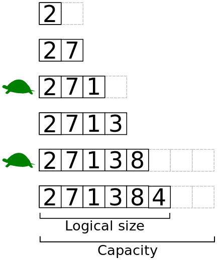

# Array
가장 기본적인 자료구조의 하나로, 순서대로 번호가 붙은 `element(원소)`의 고정된 크기의 **연속적**인 형태로 구성되어 있다. 이 때 각 번호는 `index(인덱스)`라고 불리며, 배열에서 원소의 `value(값)`에 접근하고 원소를 유지한다. 이 인덱스 값만 알고 있으면 해당 원소에 `O(1)` 시간에 바로 접근할 수 있는, 즉 `random access(비순차적 접근)`이 가능하다.

배열의 한계는 메모리를 낭비할 가능성이 있다는 것이다.
``` Java
public static void main(String[] args) {
	// TODO Auto-generated method stub
	String[] languageArray = {"Swift", "Java", "Objective-C", "Python", "C"};

	// 인덱스로 O(1) 시간에 바로 접근.
	System.out.println(languageArray[2]); // Objective-C
	languageArray[2] = null;

	// 연속적인 형태가 아니기 때문에 빈 공간으로 남게 됨.
	System.out.println(languageArray[2]); // null
}
```
배열은 인덱스에 따라서 값을 유지하기 때문에 빈 공간을 메꿔주지 않는다. null 값을 이용하거나 고정된 갯수의 값들을 유지해야 할 경우 배열을 사용하지만 많은 경우에 한계가 있을 것이다. 이러한 단점을 보완한 것이 `List` 자료구조이다.

# List
리스트는 배열의 인덱스의 값을 유지하려는 특성을 버리고 **빈틈없는 데이터의 적재**라는 장점을 취한 자료구조이다.

10, 20, 30, 40, 50이 담겨 있는 배열에서 만약 인덱스 3인 원소를 비우고 싶다면 이러한 이미지가 될 것이다.


그러나 만약 List라면 어떻게 될까?


List의경우 3번 인덱스의 값이 40에서 50으로 바뀌고 4번 인덱스의 원소가 사라지는 것을 볼 수 있다.

``` Java
public static void main(String[] args) {
	// TODO Auto-generated method stub
	String[] languageArray = {"Swift", "Java", "Objective-C", "Python", "C"};
	ArrayList<String> languageList = new ArrayList<String>(Arrays.asList(languageArray));

	// 마찬가지로 index로 바로 접근이 가능하다.
	System.out.println(languageList.get(2)); // Objective-C

	// 삭제 후에는 인덱스가 바뀐다.
	languageList.remove(2);
	System.out.println(languageList.get(2)); // Python
}

```

요즘 나오는 언어들의 경우 List를 기본 배열의 형태로 제공하지만 `Java`의 경우 Array와 ArrayList, LinkedList를 모두 제공해 선택하여 사용하도록 하고 있다.

## Array List
배열을 이용해 리스트를 구현한 것으로 인덱스로 바로 접근이 가능한 배열의 장점을 가져왔다.

하지만 원소의 삽입과 삭제의 경우 얘기가 다르다. 만약 하나의 원소를 삭제할 경우 원소들이 순차적으로 있기 때문에 빈 공간이 생겨 배열의 연속성이 깨지게 된다. 그래서 삭제한 원소보다 인덱스가 큰 원소들을 `shift(이동)`시켜야 하는 비용이 발생하고 이 경우 `O(n)` 시간 복잡도를 보인다. 삽입의 경우에도 마찬가지로 원소들을 뒤로 미뤄야 하기 때문에 `O(n)` 시간 복잡도를 보인다.

이러한 단점을 보완하기 위해 `Linked list` 자료구조를 활용할 수 있다.

## Linked List
데이터와 포인터를 가지고 있는 `node(노드)`라는 자료구조가 **불연속적**으로 이어져 있는 형태로 ArrayList가 가지고 있는 삽입, 삭제의 느린 점을 보완하는 리스트이다.

삽입, 삭제 시 포인터의 위치만 바꾸면 되기 때문에 `O(1)`의 시간이 걸린다. 그러나 index로 원소에 바로 접근할 수 있는 Array, ArrayList와 달리 순차적으로 접근해야 하기 때문에 O(n)이 걸린다.

이 Linked List는 트리 구조의 기반 자료구조가 된다.

## Dynamic Array
동적 배열은 정적 배열의 메모리 할당 시의 고정된 크기로부터 오는 단점을 극복한 자료구조이다.



동적 배열을 구현하는 방법은 **지금 필요한 원소의 수보다 조금 더 많이** 메모리를 할당하는 것이다. 기본 배열에 저장하다가 기본 공간보다 더 필요할 경우에 조금 더 남겨둔 공간을 사용하는 것이다. 여기서 기본 공간의 사이즈를 `Logical Size`라고하고 총 용량을 `Capacity`라 한다.

언어별로 사이즈를 늘리는 비용을 줄이기 위해 늘리는 비율은 다르다. 예를 들어 Java의 `ArrayList`의 경우 1.5, Python의 `PyListObject`의 경우 ~1.125를 적용한다.

### 시간 복잡도

- 원소 추가
  - 공간이 남아 있을 때: 배열의 끝에 추가할 경우 상수 시간(`O(1)`) 내에 할 수 있다. 그 밖의 경우에 원소들을 이동해야 하므로 `O(n)`이 걸린다.
  - 공간이 더 필요할 때: `resizing`을 해야하므로 일반적으로 비용이 높다. 왜냐하면 새로운 배열을 할당해야할 뿐만 아니라 기존의 배열에서 모든 원소들을 복사해서 새로운 배열에 넣어야 하기 때문이다.
- 원소 삭제: 배열의 끝을 삭제할 경우 `O(1)` 시간, 그 밖의 경우에는 `O(n)`이 걸린다.
