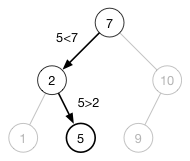
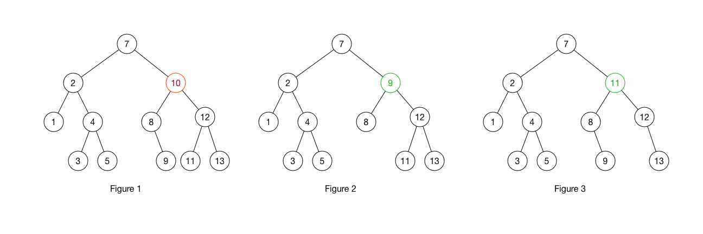

# 이진 탐색 트리 (Binary Search Tree) Part 1

이진 탐색 트리는 이진 트리의 특별한 형태로서, 노드의 삽입과 삭제 후에도 항상 정렬이 유지된다.

## 트리의 기본 개념

### 항상 정렬


왼쪽 자식 노드의 값은 항상 부모 노드보다 작고, 오른쪽 자식 노드의 값은 항상 부모 노드보다 크다. 이것이 이진 탐색 트리의 중요한 특성이다.

### 노드 삽입

새로운 노드를 삽입하고자 할 때는 우선 새 노드의 값과 루트 노드의 값을 비교한다. 새 노드의 값이 더 작다면 왼쪽 가지를 택하고, 더 크다면 오른쪽 가지를 택한다. 새로운 노드가 위치할 빈 자리를 찾을 때까지 이것을 반복한다.

위 그림에서 새로운 값 9를 삽입해보자. 우선 루트 노드인 7에서 시작한다. 9는 7보다 크므로 오른쪽 가지를 택한다. 오른쪽 가지에 위치한 10보다 9가 작으므로 왼쪽 가지를 택한다. 왼쪽 가지는 현재 비어있으므로 9가 이곳에 위치한다. 다음 그림은 9가 삽입하고 난 이후의 모습이다.


새로운 값이 삽입될 수 있는 공간은 단 한 곳 밖에 없다. 트리의 높이를 h라고 했을 때 삽입에 걸리는 시간은 O(h)로서 빠르다.

### 노드 탐색

트리 안에 특정 값이 있는지 확인하는 방법은 삽입의 방식과 유사하다. 찾는 값이 현재 노드의 값보다 작으면 왼쪽 가지를 탄다. 더 크다면 오른쪽 가지를 탄다. 동일하다면 탐색을 성공한 것이다. 리프 노드에 닿았지만 찾지 못하였다면 트리 안에 찾는 값이 없는 것이다. 다음은 5를 찾는 과정을 그림으로 표현한 것이다.



트리를 이용한 탐색은 빠르다. O(h) 시간이 소요된다. 100만 개의 노드로 구성된 트리가 균형이 잘 잡혀 있다고 한다면, 20번의 이동 안에 어떤 값이든 찾을 수 있다.

### 노드 삭제

노드를 제거하는 것은 쉽다. 노드를 제거하고 나서 왼쪽 서브 트리를 구성하는 노드들 중 값이 가장 큰 노드를 그 자리로 이동시키거나, 또는 오른쪽 서브 트리의 노드들 중 가장 작은 노드를 이동시키면 된다. 아래 그림에서 Figure 2는 전자, Figure 3는 후자에 해당한다.



자식이 없는 노드를 삭제하는 경우에는 더 간단하다. 빈 자리를 채우기 위하여 교체할 필요가 없으므로 부모 노드로부터 제거하면 끝이다.


## 구현

Swift로 트리를 구현하는 방법은 두 가지가 있다. 클래스와 열거형이다.

### 클래스로 구현

```swift
public class BinarySearchTree<T: Comparable> {
  private(set) public var value: T
  private(set) public var parent: BinarySearchTree?
  private(set) public var left: BinarySearchTree?
  private(set) public var right: BinarySearchTree?

  public init(value: T) {
    self.value = value
  }

  public var isRoot: Bool {
    return parent == nil
  }

  public var isLeaf: Bool {
    return left == nil && right == nil
  }

  public var isLeftChild: Bool {
    return parent?.left === self
  }

  public var isRightChild: Bool {
    return parent?.right === self
  }

  public var hasLeftChild: Bool {
    return left != nil
  }

  public var hasRightChild: Bool {
    return right != nil
  }

  public var hasAnyChild: Bool {
    return hasLeftChild || hasRightChild
  }

  public var hasBothChildren: Bool {
    return hasLeftChild && hasRightChild
  }

  public var count: Int {
    return (left?.count ?? 0) + 1 + (right?.count ?? 0)
  }
}
```

이 클래스는 트리 전체가 아니라 하나의 노드를 표현하는 것이다. 제네릭 타입으로 구현되어 있어서 어떤 종류의 데이터도 저장이 가능하다. 또 왼쪽과 오른쪽 자식 노드들과 부모 노드의 레퍼런스를 프로퍼티로 가지고 있다. 다음과 같이 사용한다.

```swift
let tree = BinarySearchTree<Int>(value: 7)
```

`count` 프로퍼티는 현재 노드를 기준으로 트리를 구성하는 모든 노드의 개수를 의미한다. 만약 현재 노드가 루트 노드라면 트리 전체의 노드 개수를 세는 것이다. Swift의 옵셔널 체이닝과 닐 결합 연산자를 활용하여 간편하게 표현할 수 있다.

#### 노드 삽입

노드는 그 자체로는 별 의미가 없다. 트리에 새로운 노드를 추가하는 코드는 다음과 같다.

```swift
public func insert(value: T) {
  if value < self.value {
    if let left = left {
      left.insert(value: value)
    } else {
      left = BinarySearchTree(value: value)
      left?.parent = self
    }
  } else {
    if let right = right {
      right.insert(value: value)
    } else {
      right = BinarySearchTree(value: value)
      right?.parent = self
    }
  }
}
```

트리의 다른 연산들과 마찬가지로 삽입 연산은 재귀를 통해 쉽게 구현할 수 있다. 새로운 값과 현재 노드의 값을 비교하여 왼쪽 가지를 탈지 오른쪽 가지를 탈지 정한다. 이미 트리에 존재하는 값을 중복하여 삽입하는 경우에는 오른쪽을 타게 한다. 왼쪽 또는 오른쪽에 더 이상 자식이 존재하지 않는다면 새로운 노드를 만들고 `parent` 프로퍼티를 설정하여 연결시킨다.

> 트리는 재귀적인 형태로 구현되어 있기 때문에 새로운 노드를 삽입하고자 할 때는 반드시 루트 노드를 통해 삽입하여야 한다. 그렇지 않고 루트 노드의 하위에 있는 노드를 통한다면 이진 트리는 더 이상 유효하지 않을 것이다.

다음과 같이 사용하여 완전한 트리를 구성할 수 있다.

```swift
let tree = BinarySearchTree<Int>(value: 7)
tree.insert(2)
tree.insert(5)
tree.insert(10)
tree.insert(9)
tree.insert(1)
```

편의를 위해 배열을 전달받아 트리를 구성하는 편의 이니셜라이저를 구현한다.

```swift
public convenience init(array: [T]) {
  precondition(array.count > 0)
  self.init(value: array.first!)
  for v in array.dropFirst() {
    insert(value: v)
  }
}
```

편의 이니셜라이저는 다음과 같이 사용한다. 배열의 첫 번째 요소가 루트 노드의 값이다.

```swift
let tree = BinarySearchTree<Int>(array: [7, 2, 5, 10, 9, 1])
```


#### 탐색

```swift
public func search(value: T) -> BinarySearchTree? {
  if value < self.value {
    return left?.search(value)
  } else if value > self.value {
    return right?.search(value)
  } else {
    return self  // 탐색 성공!
  }
}
```

탐색은 현재 노드(주로 루트 노드)에서 시작하여 값을 비교하는 과정이다. 찾는 값이 현재 노드의 값보다 작으면 왼쪽 가지를, 크면 오른쪽 가지를 탄다. 왼쪽이나 오른쪽에 더 이상 비교할 노드가 남아있지 않다면 `nil`을 반환하여 값이 없다는 결과를 준다. Swift의 옵셔널 체이닝을 통해 if 문 없이 간편하게 `nil`을 반환할 수 있다.

다음과 같이 탐색한다. 6은 트리에 존재하지 않으므로 마지막 코드는 nil을 반환한다. 트리 내에 동일한 값이 여럿 존재하는 경우에는 위치 상 가장 높은 곳에 있는 것부터 탐색된다.

```swift
tree.search(5)
tree.search(2)
tree.search(7)
tree.search(6)   // nil
```

#### 노드 순회

```swift
public func traverseInOrder(process: (T) -> Void) {
  left?.traverseInOrder(process: process)
  process(value)
  right?.traverseInOrder(process: process)
}

public func traversePreOrder(process: (T) -> Void) {
  process(value)
  left?.traversePreOrder(process: process)
  right?.traversePreOrder(process: process)
}

public func traversePostOrder(process: (T) -> Void) {
  left?.traversePostOrder(process: process)
  right?.traversePostOrder(process: process)
  process(value)
}
```

순회 또한 마찬가지로, 옵셔널 체이닝 덕분에 왼쪽 또는 오른쪽 노드가 없는 경우에는 알아서 무시하게 된다.

다음과 같이 사용하여 실제로 어떻게 순회하는지 확인해볼 수 있다.

```swift
tree.traverseInOrder { value in print(value) }
```

#### 노드 삭제

특정 노드를 삭제하는 메서드를 작성하기 전에 먼저 헬퍼 메서드들을 구현해보자.

노드 삭제로 인해 트리에 변화를 발생시키는 것은 parent와 left, right 포인터의 변화를 수반한다. 다음의 헬퍼 메서드는 현재 노드의 부모 노드와 자식 노드 중 하나를 연결해주는 역할을 한다.

```swift
private func reconnectParentToNode(node: BinarySearchTree?) {
  if let parent = parent {
    if isLeftChild {
      parent.left = node
    } else {
      parent.right = node
    }
  }
  node?.parent = parent
}
```

다음 메서드들은 각각 트리의 최소값과 최대값을 가지는 노드를 반환한다. 이 노드는 노드 삭제 이후 빈 자리를 채우기 위한 것이다.

```swift
public func minimum() -> BinarySearchTree {
  var node = self
  while let next = node.left {
    node = next
  }
  return node
}

public func maximum() -> BinarySearchTree {
  var node = self
  while let next = node.right {
    node = next
  }
  return node
}
```

```swift
@discardableResult public func remove() -> BinarySearchTree? {
  let replacement: BinarySearchTree? // 제거 후 빈 자리를 대체하는 노드

  // replacement는 현재 노드의 왼쪽에서 가장 크거나 오른쪽에서 가장 작은 노드이다. 둘 다 아니라면 nil이다.
  if let right = right {
    replacement = right.minimum()
  } else if let left = left {
    replacement = left.maximum()
  } else {
    replacement = nil
  }

  replacement?.remove()

  // replacement를 현재 노드 위치에 위치시킨다.
  replacement?.right = right
  replacement?.left = left
  right?.parent = replacement
  left?.parent = replacement
  reconnectParentTo(node:replacement)

  // 현재 노드는 삭제되어 더 이상 트리에 존재하지 않는다.
  parent = nil
  left = nil
  right = nil

  return replacement
}
```

#### 깊이와 높이

트리의 높이는 현재 노드에서 가장 낮은 곳에 위치한 리프 노드까지의 거리이다. 트리의 높이를 구하는 것은 모든 노드를 거쳐야 하는 작업이므로 O(n)의 성능을 보인다. 이를 구현한 메서드는 다음과 같다.

```swift
public func height() -> Int {
  if isLeaf {
    return 0
  } else {
    return 1 + max(left?.height() ?? 0, right?.height() ?? 0)
  }
}
```

노드의 깊이는 현재 노드에서 루트 노드까지의 거리이다. 높이와 다르게 이것은 트리의 위쪽 방향을 향하여 루트 노드에 닿을 때까지 나아가는 개념이다. O(h) 시간이 소요된다. 이를 구현한 메서드는 다음과 같다.

```swift
public func depth() -> Int {
  var node = self
  var edges = 0

  // 루트 노드의 parent는 nil이다.
  while let parent = node.parent {
    node = parent
    edges += 1
  }
  return edges
}
```

#### 전임자와 후임자

이진 탐색 트리는 항상 정렬되어 있기는 하지만 현재 노드의 값과 왼쪽 또는 오른쪽 노드의 값이 항상 연속적인 것은 아니다. 연속된 값이 바로 이어지지 않고 트리 내에 더 떨어진 곳에 위치할 수 있다는 뜻이다.


예를 들어 위 그림에서 7의 전임자는 바로 왼쪽에 위치한 2가 아니라 5이다. 5는 왼쪽 서브 트리의 노드들 중 가장 큰 값이기도 하다. 반대로 7의 후임자는 9이다.

전임자를 구하는 `predecessor()`와 후임자를 구하는 `successor()` 메서드는 다음과 같다. 둘은 서로 거울을 바라보듯 구현한다.

```swift
public func predecessor() -> BinarySearchTree<T>? {
  if let left = left {
    return left.maximum()
  } else {
    var node = self
    while let parent = node.parent {
      if parent.value < value { return parent }
      node = parent
    }
    return nil
  }
}
```

전임자를 구하기 위하여 왼쪽 서브 트리의 최대값을 구한다. 왼쪽 서브 트리가 없다면 부모 노드 쪽으로 눈을 돌린다. 예를 들어 9가 전임자를 찾는다면 부모인 10을 거쳐 7을 찾아낼 것이다.

```swift
public func successor() -> BinarySearchTree<T>? {
  if let right = right {
    return right.minimum()
  } else {
    var node = self
    while let parent = node.parent {
      if parent.value > value { return parent }
      node = parent
    }
    return nil
  }
}
```

두 메서드 모두 O(h) 시간이 걸린다.

#### 이진 탐색 트리인지 검증

새로운 노드를 삽입하는 경우에 루트 노드가 아닌 다른 노드를 통해 삽입한다면 이 트리는 더 이상 이진 탐색 트리가 아니다. 이와 같은 예외가 발생하여 트리가 이진 탐색 트리로서 유효한지 검증하기 위한 메서드는 다음과 같다. `minValue`와 `maxValue`는 저장할 수 있는 값의 범위를 나타낸다.

```swift
public func isBST(minValue minValue: T, maxValue: T) -> Bool {
  if value < minValue || value > maxValue { return false }
  let leftBST = left?.isBST(minValue: minValue, maxValue: value) ?? true
  let rightBST = right?.isBST(minValue: value, maxValue: maxValue) ?? true
  return leftBST && rightBST
}
```

## References

- [Binary Search Tree - Swift Algorithm Club](https://github.com/raywenderlich/swift-algorithm-club/tree/master/Binary%20Search%20Tree)
