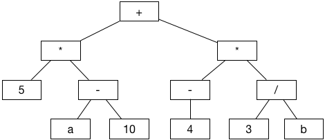

# 이진 트리 (Binary Tree)

이진 트리는 자식 노드의 수가 0, 1 또는 2인 트리를 말한다. 다음과 같은 모습이다.


자식 노드는 때때로 왼쪽 자식 또는 오른쪽 자식으로 불린다. 자식 노드를 가지고 있지 않는 노드는 리프 노트라 부른다. 최상단에 위치한 노드는 루트 노드라 부른다.

노드는 종종 부모 노드로의 링크를 가지고 있는데 이것은 필수적인 것은 아니다.

이진 트리는 이진 탐색 트리로 자주 쓰인다. 이 경우에는 노드들은 반드시 일정한 순서를 따라야 한다. 예를 들어 현재 노드보다 작은 값을 가진 노드는 왼쪽에, 큰 값을 가진 노드는 오른쪽에 위치시킨다.

## 구현

일반적인 형태의 이진 트리를 Swift로 구현한 모습은 다음과 같다. enum으로 구현되어 있고 값이 있는 경우와 없는 경우로 구분된다. 값이 있는 경우에는 `case`로서 `(왼쪽 노드, 자기의 값, 오른쪽 노드)`를 연관 값으로 가진다. 값이 없는 경우에는 `empty`이다.

```swift
public indirect enum BinaryTree<T> {
  case node(BinaryTree<T>, T, BinaryTree<T>)
  case empty
}
```

다음은 전체 노드의 개수를 반환하는 메서드이다.

```swift
public var count: Int {
  switch self {
  case let .node(left, _, right):
    return left.count + 1 + right.count
  case .empty:
    return 0
  }
}
```

다음 extension은 트리를 `print()`하였을 때 편하게 보도록 도와주는 메서드이다.

```swift
extension BinaryTree: CustomStringConvertible {
  public var description: String {
    switch self {
    case let .node(left, value, right):
      return "value: \(value), left = [\(left.description)], right = [\(right.description)]"
    case .empty:
      return ""
    }
  }
}
```

## 예시

이진 트리를 통해 수식을 표현할 수 있다. 다음의 수식을 트리로 표현해보자.

> (5 * (a - 10)) + (-4 * (3 / b))




```swift
// 리프 노드
let node5 = BinaryTree.node(.empty, "5", .empty)
let nodeA = BinaryTree.node(.empty, "a", .empty)
let node10 = BinaryTree.node(.empty, "10", .empty)
let node4 = BinaryTree.node(.empty, "4", .empty)
let node3 = BinaryTree.node(.empty, "3", .empty)
let nodeB = BinaryTree.node(.empty, "b", .empty)

// 루트 노드의 왼쪽 노드
let Aminus10 = BinaryTree.node(nodeA, "-", node10)
let timesLeft = BinaryTree.node(node5, "*", Aminus10)

// 루트 노드의 오른쪽 노드
let minus4 = BinaryTree.node(.empty, "-", node4)
let divide3andB = BinaryTree.node(node3, "/", nodeB)
let timesRight = BinaryTree.node(minus4, "*", divide3andB)

// root node
let tree = BinaryTree.node(timesLeft, "+", timesRight)
```

## 순회

트리를 다루다보면 트리를 순회할 일이 생긴다. 예를 들어 트리 전체를 특정 순서로 순회해야 하는 것이 그렇다. 순회에는 다음의 세 가지 방식이 있다.

1. 중위 순회(In-order traversal): 왼쪽 자식 노드 -> 자기 노드 -> 오른쪽 자식 노드, 깊이 우선 방식이라고도 부른다.
2. 전위 순회(Pre-order traversal): 자기 노드 -> 왼쪽 자식 노드 -> 오른쪽 자식 노드
3. 후위 순회(Post-order traversal): 왼쪽 자식 노드 -> 오른쪽 자식 노드 -> 자기 노드

```swift
public func traverseInOrder(process: (T) -> Void) {
  if case let .node(left, value, right) = self {
    left.traverseInOrder(process: process)
    process(value)
    right.traverseInOrder(process: process)
  }
}

public func traversePreOrder(process: (T) -> Void) {
  if case let .node(left, value, right) = self {
    process(value)
    left.traversePreOrder(process: process)
    right.traversePreOrder(process: process)
  }
}

public func traversePostOrder(process: (T) -> Void) {
  if case let .node(left, value, right) = self {
    left.traversePostOrder(process: process)
    right.traversePostOrder(process: process)
    process(value)
  }
}
```

후위 순회로 앞서 언급한 수식 트리를 순회한다면 다음과 같은 순서로 순회할 것이다.

```
5
a
10
-
*
4
-
3
b
/
*
+
```

## References

- [Binary Tree - Swift Algorithm Club](https://github.com/raywenderlich/swift-algorithm-club/tree/master/Binary%20Tree)
