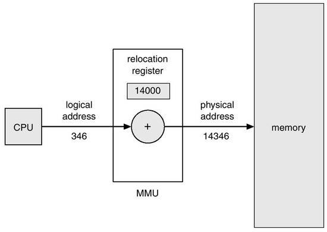
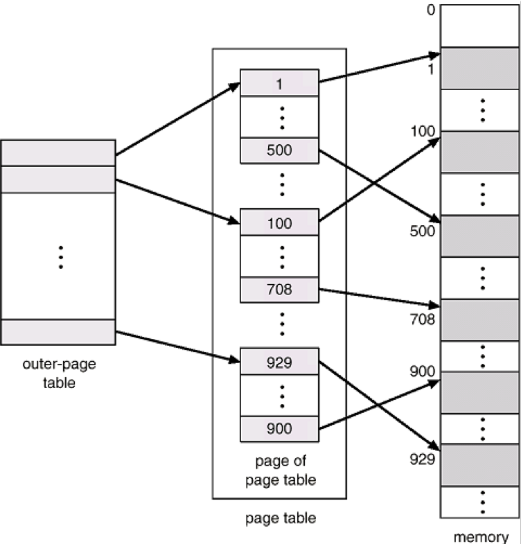
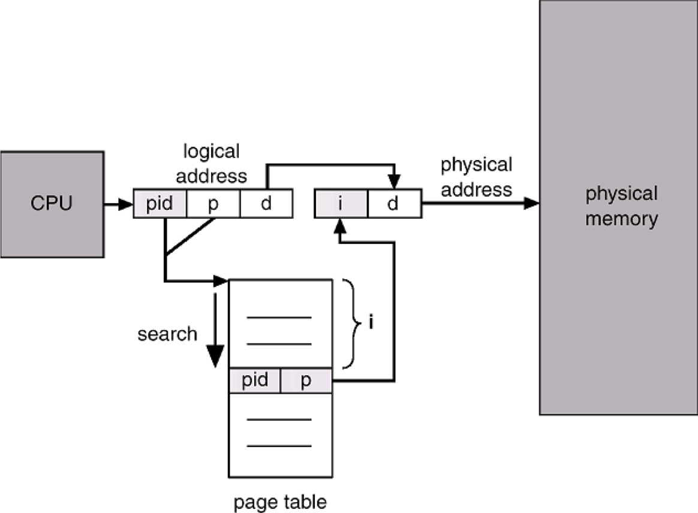
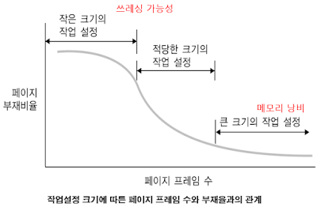

# 메모리 관리전략

## 서론
CPU의 활용률을 극대화하는 목적 아래, 사용자에게 빠른 응답을 제공하려다 보니 메모리에 보다 많은 프로그램이 로드되어 실행된다. 하지만 메모리는 **한정된 자원**이기 때문에 메모리 관리의 필요성이 등장했다.

## 주소 공간(Address Space)
정의
  - 프로세스에서 참조할 수 있는 주소들의 범위(집합)
  - 프로세스와 1-1의 관계
  - 사용자 스레드는 주소 공간을 공유

주소 공간의 크기
  - CPU의 주소 버스(address bus)의 크기에 의존
  - 주소 버스가 32bit인 시스템에서는 232개의 서로 다른 주소에 대한 식별자를 만들 수 있으므로 0부터 232-1 까지의 주소 범위를 가질 수 있다.

### 물리 주소와 가상 주소
- 물리 주소(physical address)
  - 컴퓨터의 메인 메모리를 접근할 때 사용되는 주소
  - 기억 장치의 주소 레지스터에 적재되는 주소
- 가상 주소(logical or virtual address)
  - CPU가 생성하는 주소로 프로세스 관점에서 사용
  - CPU 관점의 주소는 물리 주소도, 가상 주소도 될 수 있음(어떤 메모리 모델을 사용하느냐에 따라 달라짐.)

컴파일 타임과 적재 시에 바인딩을 할 경우 물리주소, 논리 주소가 같지만 **실행시간 바인딩 기법에서는 다르다**. 그래서 실행 중일 때 가상 주소를 물리 주소를 바꾸어줄 때 사용하는 것이 `메모리 관리기(MMU, Memory Management Unit)`이다.

메모리 관리기를 사용한 방법은 여러 가지 방법이 있다. 그 중 위의 그림과 같이 논리 주소를 물리 주소로 변환해 주는 `기준 레지스터(base register)`를 사용하는 방법이 있다. 여기서 기준 레지스터는 `재배치(relocation) 레지스터`라고 부른다.

**사용자 프로그램은 실제 메모리 주소에 대해 모른다는 것을 주의하자.** 단지 논리 주소만 알 뿐, 실제 실행되어 실제 메모리의 위치를 정하는 것은 기준 레지스터의 바인딩이다.

### 초창기 컴퓨터의 주소 관리
`물리 주소`를 Compile time에 생성한다.
- 컴파일러가 프로세스가 물리 메모리에서 실행되는 주소를 compile time에 알아서 절대 코드를 생성.
- 시작 주소의 위치가 바뀔 경우 다시 compile 해야함.

그러나 다양한 프로그램이 실행됨에 따라 compile time에 물리 주소를 정하기가 어려워지고 메인 메모리보다 큰 용량의 프로그램을 돌릴 수 없다.
 -> `가상 메모리`가 등장!

### 가상 메모리
프로세스가 수행되기 위해서 프로그램의 모든 부분이 실제 메모리(physical memory)에 올라갈 필요가 없고, 현재 실행되고 있는 code 부분만 올리자!
- 정의: 메모리로서 실제 존재하지는 않지만 사용자에게 메모리로서의 역할을 하는 메모리(virtual)

가상 메모리를 실제 메모리에 매핑하는 방법으로 `Page Table(페이지 테이블)`을 사용한다.

## Paging(페이징)
주소 공간을 동일한 크기의 page로 나누어 관리
- 보통 1page의 크기는 4KB로 나누어 사용.
- 프레임(Frame): 물리 메모리를 고정된 크기로 나누었을 때, 하나의 블록.
- 페이지(Page): 가상 메모리를 고정된 크기로 나누었을 때, 하나의 블록.
- 각각의 프레임과 페이지의 크기는 같다.

하나의 프레임에 하나의 페이지가 들어 갔다가 나갔다가 하면서 큰 용량의 여러 프로그램이 돌아갈 수 있다.

페이지가 하나의 프레임을 할당 받으면, 물리 메모리에 위치하게 된다. 하지만 받지 못한 페이지들은 외부 저장장치(Backing store)에 저장된다.

## 페이지 테이블

가상 주소를 실제 메모리 주소에 매핑하는 역할을 함.
- 각 프로세스의 페이지 정보를 저장함.
- 인덱스: 페이지 번호
- 내용: 해당 페이지에 할당된 물리 메모리(프레임)의 시작 주소. 시작 주소와 페이지 주소를 결합하여 원하는 데이터가 있는 물리 메모리 주소를 알 수 있다.

페이지 테이블은 물리 메모리에 위차하며 PTBR(Page-table base register)이 메모리의 내의 페이지 테이블을 가리키고, PTLR(Page-table length register)가 페이지 테이블의 사이즈를 나타낸다.

PTBR은 마치 PCB처럼 CPU 당 하나가 존재하면서 페이지 테이블의 위치를 알려줌.

- 페이지 테이블은 언제 만들어 질까?
  - 프로세스가 만들어 질 때 만들어짐.

### PTE(Page Table Entry)
페이지 테이블의 레코드로 페이지 테이블에 대한 정보를 담고 있다. 정보에는 할당된 프레임의 주소와 접근, 변경 등이 있었는지가 있다.

### TLB(Translation Look-aside Buffers)
페이징 방법을 사용하면 페이지 테이블에 한 번, 물리 메모리 내에 한 번, 즉 두 번 거쳐야하기 때문에 속도 문제가 존재.

그래서 캐쉬로 `TLB`를 사용하자! 페이지 테이블을 이용해 변환된 주소를 TLB에 저장해 놓고 다음에 접근할 때는 사용하자.

### Multilevel Page Table
- 가상 주소 공간이 매우 큰 용량을 차지하게 되어 페이티 테이블의 크기가 너무 커져 페이징이 잘 이루어지지 않음.
- 페이지 테이블을 가리키는 페이지 테이블을 만들어 해결.

- 레벨이 증가할 수록 페이지 테이블이 차지하는 메모리는 줄어들지만, **Table walk에 걸리는 시간이 증가하는 문제점이 발생**.

### Inverted Page Table
마찬가지로 페이지 테이블의 용량 증가를 해결하기 위한 대안으로 거꾸로 물리 메모리에서 가상 메모리의 페이지를 찾는 방식이다.
- PID를 통해 페이지 테이블에서 페이지 ID를 검색하고 일치하는 것이 있다면 그 가상주소를 물리 주소에 결합해 실제 물리 주소를 찾는다.

- 실제 존재하는 매핑된 페이지만 테이블에 저장하기 때문에, 용량이 적지만, 테이블을 검색하는 데 시간이 오래 걸린다.

### Demand Paging
프로세스의 실행을 위한 모든 페이지를 메모리에 올리는 대신, 필요한 page의 요청이 있을 때 올리는 페이징 기법.
- 필요한 페이지를 secondary storage에서 메모리로 옮김.
- 장점
  - 실행을 위한 물리 메모리 구성 시간이 줄어듦.
  - 프로세스의 전체 이미지를 올리지 않기 때문에 메모리 절약이 가능.
- 단점
  - 참조하고자 하는 페이지가 invalid 할 경우 실제 물리 메모리에 없으므로 `Page fault`가 발생.

- 위의 그림과 같이 페이지 테이블에 valid/invalid 플래그를 추가해 페이지 폴트가 발생했을 경우 `Page Fault Handler`를 실행한다.
- Page Fault Handler의 수행 내용
  1. 새로운 프레임 할당 받음
  2. Backing store에서 페이지의 내용을 다시 프레임에 불러들임.
  3. 페이지 테이블을 재구성.
  4. 프로세스의 작업 재시작.

### Thrashing
프로세스의 실행 시간 중, page fault를 처리하는 시간이 실행 시간보다 긴 상황.

- 요구 페이징 모델은 `지역성 모델(Locality model)`에 기반하여 동작하는데, 이는 **프로세스가 어떤 특정한 지역에서 메모리를 집중적으로 참조함**을 의미한다.
- 이 때 충분히 페이지를 할당 받지 못할 경우, 빈번한 페이지 교체로 인해 `스래싱`이 발생.
- 가장 최근에 참조된 페이지 집합인 `Working Set`을 메모리에 유지시켜 해결.

